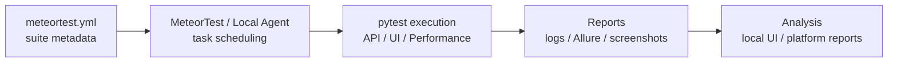
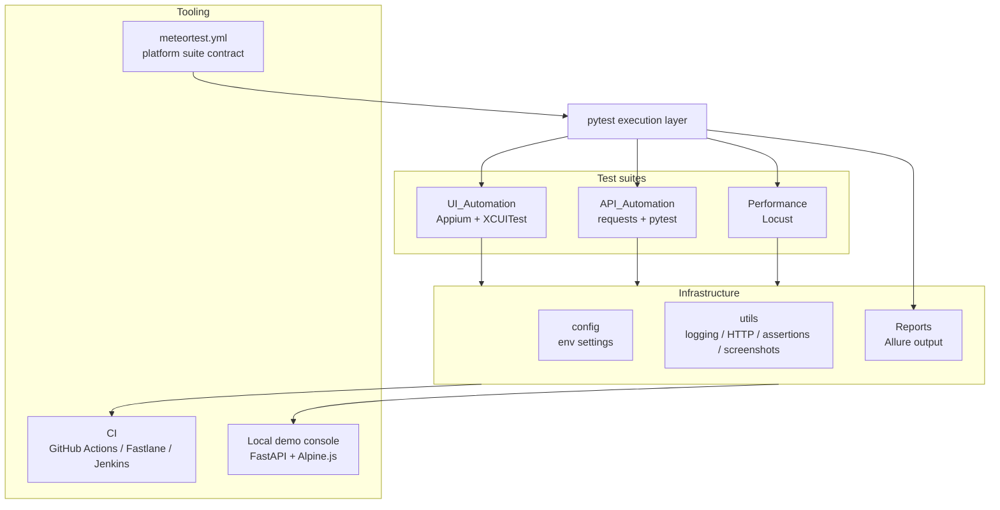
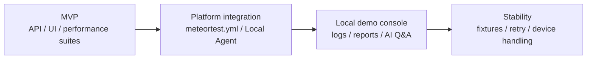

# iOS-Automation-Framework

<p align="center">
  <strong>An iOS automation test project for API, UI, performance, reporting, and platform integration</strong>
</p>

<p align="center">
  
  
  
  
  <br />
  <a href="https://github.com/JunchenMeteor/MeteorTest"></a>
  <a href="https://github.com/JunchenMeteor/iOS-Automation-Framework/issues"></a>
  <a href="#roadmap"></a>
  <br />
  <a href="README.md"></a>
  <a href="README.zh-CN.md"></a>
</p>

iOS-Automation-Framework is a complete mobile automation test project for the Yunlu Mall iOS app. It combines API tests, iOS UI tests, performance tests, Allure reports, CI configuration, and a local demo Web UI.

In the broader platform system, this repository is the test-code carrier and first integration sample. It owns how tests are written and executed: pytest/Appium cases, Page Objects, test data, assertions, and report output. A platform such as [MeteorTest](https://github.com/JunchenMeteor/MeteorTest) owns scheduling, executor status, task metadata, and result collection.

## Table of Contents

- [Background](#background)
- [Core Capabilities](#core-capabilities)
- [Execution Loop](#execution-loop)
- [Architecture](#architecture)
- [Project Structure](#project-structure)
- [Quick Start](#quick-start)
- [Platform Integration](#platform-integration)
- [Local Demo Console](#local-demo-console)
- [Test Coverage](#test-coverage)
- [Implementation Notes](#implementation-notes)
- [Validation and CI](#validation-and-ci)
- [Roadmap](#roadmap)
- [License](#license)
- [Maintainer](#maintainer)

## Background

Mobile automation projects often start as simple scripts, then gradually become hard to maintain:

- UI locators are scattered across test cases.
- API, UI, and performance tests use different conventions.
- Test data, environment configuration, and report output are not standardized.
- CI can run tests, but local debugging and report inspection are inconvenient.
- A central platform can schedule work, but each test repository still needs a clear contract for suites and commands.

This project addresses those problems by keeping test implementation, local demo tooling, and platform integration metadata in one repository.

## Core Capabilities

- Page Object Model for iOS UI automation.
- Data-driven API tests using YAML data and pytest parametrization.
- API, UI, and performance test suites in one test repository.
- Allure report output for local runs, CI runs, and platform-triggered runs.
- GitHub Actions and Fastlane/Jenkins configuration examples.
- Local Web UI for code browsing, controlled test execution, real-time logs, Allure reports, and AI Q&A.
- Platform integration contract through `meteortest.yml`.

## Execution Loop



## Architecture



## Project Structure

```text
iOS-Automation-Framework/
├── API_Automation/
├── UI_Automation/
├── Performance/
├── config/
├── utils/
├── tools/webui/
├── docs/
├── CI/
├── Reports/
├── meteortest.yml
├── requirements.txt
├── pytest.ini
└── conftest.py
```

By responsibility:

- `API_Automation/`: API wrappers, test cases, and YAML test data.
- `UI_Automation/`: Appium UI automation using Page Object Model and XCUITest.
- `Performance/`: Locust performance test scripts.
- `config/`: environment configuration, local settings template, and global settings.
- `utils/`: logging, HTTP client, assertions, and screenshot utilities.
- `tools/webui/`: local demo console for browsing files, running tests, viewing logs, and opening reports.
- `docs/`: design notes and platform integration documentation.
- `CI/`: Jenkins and Fastlane examples.
- `Reports/`: generated reports and run artifacts; this directory is git-ignored.
- `meteortest.yml`: suite contract for MeteorTest or another Local Agent.

## Quick Start

### Requirements

- Python 3.9+
- Node.js 18+ for Appium 2.x
- Appium 2.x
- Xcode 14+ for iOS simulators
- Allure command line tool, optional but recommended for report generation

Install Appium and the XCUITest driver:

```bash
npm install -g appium
appium driver install xcuitest
```

### Install

```bash
git clone https://github.com/JunchenMeteor/iOS-Automation-Framework.git
cd iOS-Automation-Framework

python -m venv venv
source venv/bin/activate

pip install -r requirements.txt
cp config/local.yml.example config/local.yml
```

On Windows:

```powershell
python -m venv venv
.\venv\Scripts\activate
pip install -r requirements.txt
copy config\local.yml.example config\local.yml
```

Edit `config/local.yml` with your device name, app path, and test account settings.

### Run API Tests

```bash
pytest API_Automation/cases -v --alluredir=./Reports/api-results
pytest API_Automation/cases/test_user.py -v
allure generate ./Reports/api-results -o ./Reports/api-report --clean
allure open ./Reports/api-report
```

### Run iOS UI Tests

Start Appium in a separate terminal:

```bash
appium
```

Run UI tests serially:

```bash
pytest UI_Automation/Tests -v -n 0 --alluredir=./Reports/ui-results
```

### Run Performance Tests

```bash
cd Performance/locust_scripts
locust -f locustfile.py --host=https://api-dev.yunlu.com
```

## Platform Integration

A platform or Local Agent should read `meteortest.yml` at the repository root, select a suite from a task, and run the declared command.

Example:

```bash
python -m pytest API_Automation/cases -v -n 0 --alluredir=Reports/platform/local-demo-001/allure-results
python -m pytest UI_Automation/Tests -v -n 0 --alluredir=Reports/platform/local-demo-001/allure-results
```

Platform-triggered API suites use `-n 0` to run serially. The project-level `pytest.ini` enables `pytest-xdist` with `-n auto` for normal local runs, but serial execution is more stable for Windows Local Agent runs and avoids temporary-directory permission failures.

Platform-triggered runs should write artifacts under:

```text
Reports/platform/{task_id}/
├── logs.txt
├── allure-results/
├── allure-report/
└── screenshots/
```

The tested `.ipa` or `.app` should be passed by the platform task as `app_path` or `app_url`. This repository does not build the app and does not own general-purpose task scheduling.

API smoke suites require `API_BASE_URL` to point to the target service. Without it, the API integration tests are collected successfully but skipped intentionally. When it is set, it overrides the `api.base_url` value from `config/environments.yaml`:

```powershell
$env:TEST_ENV="staging"
$env:API_BASE_URL="https://your-staging-api.example.com"
.venv\Scripts\python.exe -m pytest API_Automation\cases -v -n 0 -m smoke
```

For MeteorTest Local Agent runs, set `API_BASE_URL` in the same shell before starting the Agent so the suite subprocess inherits it.

### Local mock API for smoke evidence

For public-safe local validation, this repository includes a small mock API that covers the current `-m smoke` API cases. It lets the smoke suite produce real pass/fail results without depending on a private staging backend.

Start the mock API:

```powershell
.venv\Scripts\python.exe -m tools.mock_api.server --host 127.0.0.1 --port 8010
```

In another shell, run the smoke suite against it:

```powershell
$env:API_BASE_URL="http://127.0.0.1:8010"
.venv\Scripts\python.exe -m pytest API_Automation\cases -v -n 0 -m smoke
```

Boundary: the mock API is deterministic local test infrastructure. It is not the real product backend and should not be used to claim production API coverage.

## Local Demo Console

The repository includes a local Web UI for debugging and demonstration. It is useful for browsing code, running whitelisted tests, viewing real-time logs, opening Allure reports, and trying project-aware AI Q&A.

It is not a general test platform and is not intended for production deployment.

Start it with:

```bash
python -m uvicorn tools.webui.app:app --host 127.0.0.1 --port 8000
```

Open:

```text
http://127.0.0.1:8000
```

Prepare local settings:

```bash
cp tools/webui/.env.example tools/webui/.env
```

Important settings:

| Variable | Default | Description |
|---|---|---|
| `AI_PROVIDER` | `mock` | `mock` or `claude` |
| `AI_MODEL` | `claude-sonnet-4-6` | AI model ID |
| `AI_API_KEY` | empty | Claude API key, not needed in mock mode |
| `ALLURE_BIN` | `allure` | Allure command path |
| `MAX_CONCURRENT_RUNS` | `1` | Maximum concurrent runs |

## Test Coverage

Current sample coverage is organized around Yunlu Mall.

### UI Automation

| Module | Scope | Cases |
|---|---|---:|
| Login | phone login, verification code, password login | 15 |
| Home | banner, category navigation, recommended products | 12 |
| Category | category list, filtering, sorting, product cards | 10 |
| Product Detail | image preview, spec selection, add to cart | 18 |
| Cart | quantity update, delete, checkout | 14 |
| Order | submit order, payment, order list | 20 |
| **Total** |  | **89** |

### API Automation

| Module | APIs | Cases |
|---|---:|---:|
| User | 8 | 32 |
| Product | 12 | 48 |
| Cart | 6 | 24 |
| Order | 10 | 40 |
| **Total** | **36** | **144** |

## Implementation Notes

### Why Page Object Model?

Page Object Model keeps UI locators and page operations in page classes, while test cases focus on business flow. When UI changes, the corresponding page class can be updated without rewriting every test case.

### Why Appium + pytest?

| Area | Choice | Reason |
|---|---|---|
| UI automation | Appium | mature ecosystem, XCUITest support, cross-platform option |
| Test framework | pytest | fixtures, parametrization, plugins |
| Reports | Allure | visual reports, trends, shareable artifacts |
| Data-driven testing | YAML + pytest parametrization | separates data from test logic |

### Stability Practices

- Prefer explicit waits over `sleep()`.
- Use multiple locator strategies: Accessibility ID, XPath, Predicate, and Class Chain.
- Retry flaky failures with `pytest-rerunfailures`.
- Capture screenshots and logs on failure.
- Keep test data isolated between cases.

## Validation and CI

Install dependencies:

```bash
pip install -r requirements.txt
```

Run focused validation:

```bash
python -m pytest API_Automation/cases -q
python -m pytest UI_Automation/Tests -q -n 0
python -m pytest Performance -q
```

CI examples live under:

```text
.github/
CI/
```

## Roadmap



## License

MIT License © 2024

## Maintainer

Maintained by **Meteor**. This project records a practical mobile automation engineering workflow, from Page Object design and API layering to CI/CD and platform integration.
