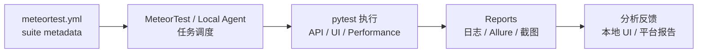
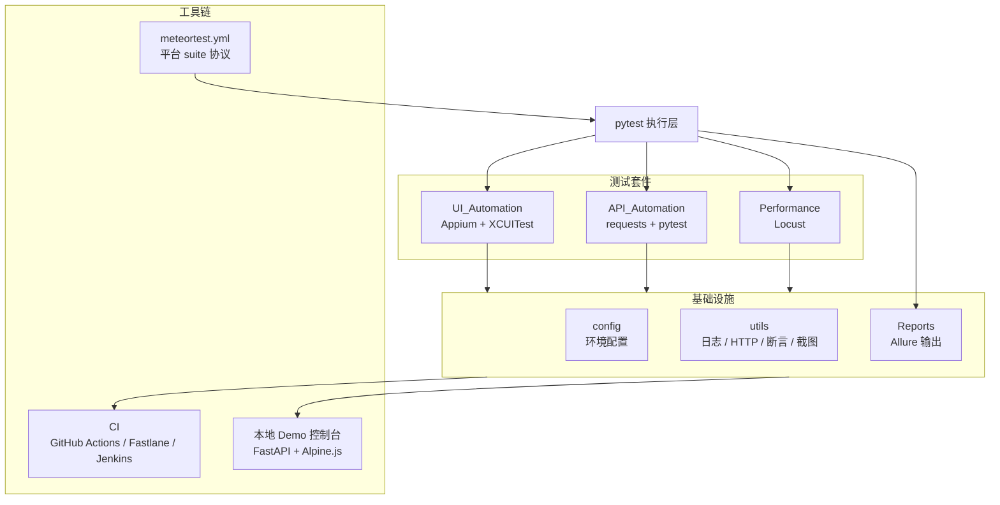
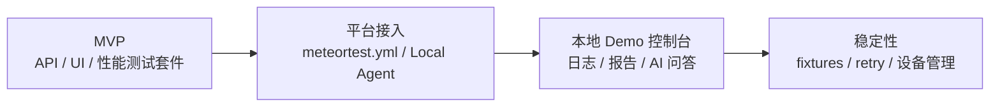

# iOS-Automation-Framework

<p align="center">
  <strong>面向 API、UI、性能、报告和平台接入的 iOS 自动化测试工程</strong>
</p>

<p align="center">
  
  
  
  
  <br />
  <a href="https://github.com/JunchenMeteor/MeteorTest"></a>
  <a href="https://github.com/JunchenMeteor/iOS-Automation-Framework/issues"></a>
  <a href="#路线规划"></a>
  <br />
  <a href="README.md"></a>
  <a href="README.zh-CN.md"></a>
</p>

iOS-Automation-Framework 是一个面向云鹿商城 iOS App 的完整移动端自动化测试工程，覆盖 API 测试、iOS UI 测试、性能测试、Allure 报告、CI 配置和本地 Demo 控制台。

在更大的平台体系中，本仓库是测试代码载体和第一个接入样板。它负责“测试怎么写、怎么执行”：pytest/Appium 用例、Page Object、测试数据、断言和报告输出。像 [MeteorTest](https://github.com/JunchenMeteor/MeteorTest) 这样的通用平台负责调度、执行器状态、任务元数据和结果收集。

## 目录

- [背景](#背景)
- [核心能力](#核心能力)
- [执行闭环](#执行闭环)
- [技术架构](#技术架构)
- [项目结构](#项目结构)
- [快速开始](#快速开始)
- [平台接入](#平台接入)
- [本地 Demo 控制台](#本地-demo-控制台)
- [测试覆盖范围](#测试覆盖范围)
- [实现说明](#实现说明)
- [验证和 CI](#验证和-ci)
- [路线规划](#路线规划)
- [License](#license)
- [维护者](#维护者)

## 背景

移动端自动化项目常常从简单脚本开始，但后续会逐渐难以维护：

- UI 元素定位散落在测试用例中。
- API、UI、性能测试使用不同约定。
- 测试数据、环境配置和报告输出缺少标准化。
- CI 可以执行测试，但本地调试和报告查看不够方便。
- 中心化平台可以调度任务，但测试仓库仍需要清晰声明 suite 和执行命令。

这个项目把测试实现、本地 Demo 工具和平台接入元数据放在同一个仓库中，便于作为完整样板维护。

## 核心能力

- 面向 iOS UI 自动化的 Page Object Model。
- 使用 YAML 数据和 pytest 参数化的数据驱动 API 测试。
- 在同一个测试仓库中组织 API、UI 和性能测试套件。
- 支持本地运行、CI 运行和平台触发运行的 Allure 报告输出。
- 提供 GitHub Actions、Fastlane、Jenkins 配置示例。
- 提供本地 Web UI，用于浏览代码、受控执行测试、查看实时日志、打开 Allure 报告和体验 AI 问答。
- 通过 `meteortest.yml` 暴露平台接入协议。

## 执行闭环



## 技术架构



## 项目结构

```text
iOS-Automation-Framework/
├── API_Automation/
├── UI_Automation/
├── Performance/
├── config/
├── utils/
├── tools/webui/
├── docs/
├── CI/
├── Reports/
├── meteortest.yml
├── requirements.txt
├── pytest.ini
└── conftest.py
```

按职责看：

- `API_Automation/`：API 封装、测试用例和 YAML 测试数据。
- `UI_Automation/`：基于 Appium、XCUITest 和 Page Object Model 的 UI 自动化。
- `Performance/`：Locust 性能测试脚本。
- `config/`：环境配置、本地配置模板和全局设置。
- `utils/`：日志、HTTP 客户端、断言和截图工具。
- `tools/webui/`：本地 Demo 控制台，用于浏览文件、执行测试、查看日志和打开报告。
- `docs/`：设计说明和平台接入文档。
- `CI/`：Jenkins 和 Fastlane 示例。
- `Reports/`：生成的报告和运行产物，已加入 git ignore。
- `meteortest.yml`：MeteorTest 或其他 Local Agent 使用的 suite 协议。

## 快速开始

### 环境要求

- Python 3.9+
- Node.js 18+，用于 Appium 2.x
- Appium 2.x
- Xcode 14+，用于 iOS 模拟器
- Allure 命令行工具，可选但建议安装

安装 Appium 和 XCUITest driver：

```bash
npm install -g appium
appium driver install xcuitest
```

### 安装

```bash
git clone https://github.com/JunchenMeteor/iOS-Automation-Framework.git
cd iOS-Automation-Framework

python -m venv venv
source venv/bin/activate

pip install -r requirements.txt
cp config/local.yml.example config/local.yml
```

Windows：

```powershell
python -m venv venv
.\venv\Scripts\activate
pip install -r requirements.txt
copy config\local.yml.example config\local.yml
```

编辑 `config/local.yml`，填入设备名、App 路径和测试账号配置。

### 运行 API 测试

```bash
pytest API_Automation/cases -v --alluredir=./Reports/api-results
pytest API_Automation/cases/test_user.py -v
allure generate ./Reports/api-results -o ./Reports/api-report --clean
allure open ./Reports/api-report
```

### 运行 iOS UI 测试

在单独终端启动 Appium：

```bash
appium
```

串行执行 UI 测试：

```bash
pytest UI_Automation/Tests -v -n 0 --alluredir=./Reports/ui-results
```

### 运行性能测试

```bash
cd Performance/locust_scripts
locust -f locustfile.py --host=https://api-dev.yunlu.com
```

## 平台接入

平台或 Local Agent 应读取仓库根目录的 `meteortest.yml`，根据任务选择 suite，并执行声明的命令。

示例：

```bash
python -m pytest API_Automation/cases -v -n 0 --alluredir=Reports/platform/local-demo-001/allure-results
python -m pytest UI_Automation/Tests -v -n 0 --alluredir=Reports/platform/local-demo-001/allure-results
```

平台触发的 API suites 使用 `-n 0` 串行运行。项目级 `pytest.ini` 为普通本地运行启用了 `pytest-xdist` 的 `-n auto`，但串行执行对 Windows Local Agent 更稳定，可以避免临时目录权限失败。

平台触发运行建议统一写入：

```text
Reports/platform/{task_id}/
├── logs.txt
├── allure-results/
├── allure-report/
└── screenshots/
```

被测 `.ipa` 或 `.app` 应由平台任务以 `app_path` 或 `app_url` 传入。本仓库不负责构建 App，也不负责通用任务调度。

API smoke suites 需要通过 `API_BASE_URL` 指向目标服务。如果没有设置该变量，API 集成测试会正常收集，但会被有意跳过。设置后，它会覆盖 `config/environments.yaml` 里的 `api.base_url`：

```powershell
$env:TEST_ENV="staging"
$env:API_BASE_URL="https://your-staging-api.example.com"
.venv\Scripts\python.exe -m pytest API_Automation\cases -v -n 0 -m smoke
```

如果通过 MeteorTest Local Agent 运行，需要在启动 Agent 的同一个 shell 中设置 `API_BASE_URL`，这样 suite 子进程才能继承这个变量。

### 用于 smoke 证据的本地 Mock API

为了做公开安全的本地验证，本仓库内置了一个小型 mock API，覆盖当前 `-m smoke` API 用例需要的接口。它可以让 smoke suite 产生真实的 pass/fail 结果，而不依赖私有 staging 后端。

启动 mock API：

```powershell
.venv\Scripts\python.exe -m tools.mock_api.server --host 127.0.0.1 --port 8010
```

另开一个 shell，把 smoke suite 指向它：

```powershell
$env:API_BASE_URL="http://127.0.0.1:8010"
.venv\Scripts\python.exe -m pytest API_Automation\cases -v -n 0 -m smoke
```

边界：mock API 是确定性的本地测试基础设施。它不是被测产品的真实后端，不能用来宣称已经覆盖生产 API。

## 本地 Demo 控制台

仓库内置一个本地 Web UI，用于调试和演示。它可以浏览代码、执行白名单内测试、查看实时日志、打开 Allure 报告，并尝试项目上下文 AI 问答。

它不是通用测试平台，也不适合生产部署。

启动：

```bash
python -m uvicorn tools.webui.app:app --host 127.0.0.1 --port 8000
```

打开：

```text
http://127.0.0.1:8000
```

准备本地配置：

```bash
cp tools/webui/.env.example tools/webui/.env
```

关键配置：

| 变量 | 默认值 | 说明 |
|---|---|---|
| `AI_PROVIDER` | `mock` | `mock` 或 `claude` |
| `AI_MODEL` | `claude-sonnet-4-6` | AI 模型 ID |
| `AI_API_KEY` | 空 | Claude API Key，mock 模式不需要 |
| `ALLURE_BIN` | `allure` | Allure 命令路径 |
| `MAX_CONCURRENT_RUNS` | `1` | 最大并发任务数 |

## 测试覆盖范围

当前样例覆盖围绕云鹿商城组织。

### UI 自动化

| 模块 | 范围 | 用例数 |
|---|---|---:|
| 登录 | 手机号登录、验证码、密码登录 | 15 |
| 首页 | Banner、分类导航、推荐商品 | 12 |
| 分类 | 分类列表、筛选排序、商品卡片 | 10 |
| 商品详情 | 图片预览、规格选择、加入购物车 | 18 |
| 购物车 | 数量修改、删除、结算 | 14 |
| 订单 | 提交订单、支付、订单列表 | 20 |
| **合计** |  | **89** |

### API 自动化

| 模块 | 接口数 | 用例数 |
|---|---:|---:|
| 用户 | 8 | 32 |
| 商品 | 12 | 48 |
| 购物车 | 6 | 24 |
| 订单 | 10 | 40 |
| **合计** | **36** | **144** |

## 实现说明

### 为什么使用 Page Object Model？

Page Object Model 将 UI 元素定位和页面操作放在 Page 类中，让测试用例专注业务流程。UI 变更时通常只需要修改对应 Page 类，不需要重写大量测试用例。

### 为什么选择 Appium + pytest？

| 维度 | 选择 | 理由 |
|---|---|---|
| UI 自动化 | Appium | 生态成熟，支持 XCUITest，并保留跨平台可能性 |
| 测试框架 | pytest | fixture、参数化和插件能力完善 |
| 报告系统 | Allure | 可视化报告、趋势展示、便于分享 |
| 数据驱动 | YAML + pytest 参数化 | 测试数据和测试逻辑分离 |

### 稳定性实践

- 优先使用显式等待，避免依赖 `sleep()`。
- 使用多种元素定位策略：Accessibility ID、XPath、Predicate、Class Chain。
- 使用 `pytest-rerunfailures` 对失败用例重试。
- 失败时自动截图并记录日志。
- 用例之间保持测试数据隔离。

## 验证和 CI

安装依赖：

```bash
pip install -r requirements.txt
```

运行聚焦验证：

```bash
python -m pytest API_Automation/cases -q
python -m pytest UI_Automation/Tests -q -n 0
python -m pytest Performance -q
```

CI 示例位于：

```text
.github/
CI/
```

## 路线规划



## License

MIT License © 2024

## 维护者

由 **Meteor** 维护。本项目记录一个移动端自动化测试工程实践，从 Page Object 设计、接口分层到 CI/CD 和平台接入。
